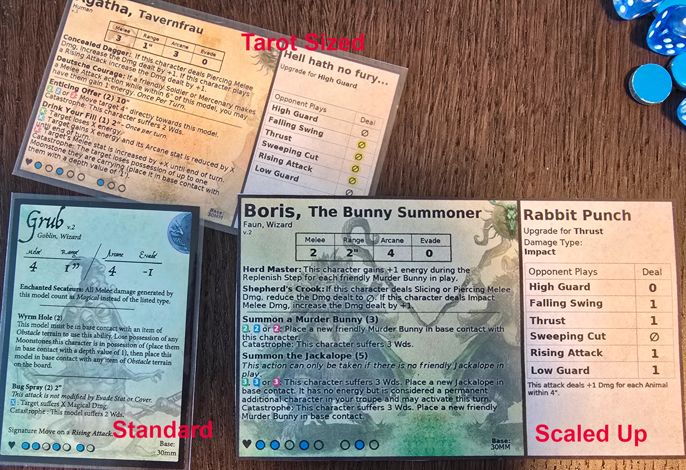

# Moonstone Wide Cards and Extras

Sections:
- [What’s in this folder](#whats-in-this-folder)
- [How to print](#how-to-print)
- [Demo Images of Custom Character Cards](#demo-images-of-custom-character-cards)
- [Custom Arcane Deck](#custom-arcane-deck)
- [Custom Melee Cards](#custom-melee-cards)
- [Custom Tokens](#custom-tokens)

### Moonstone Character Wide Cards — PDFs

These PDFs contain easy-to-read, single-sided “wide” character cards for Moonstone. Each card shows a character’s core stats and signature moves on one side so you don’t need to flip cards during play.

- Moonstone: [moonstonethegame.com](https://www.moonstonethegame.com/)
- Official downloads (original cards, rules, etc.): [moonstonethegame.com/downloads](https://www.moonstonethegame.com/downloads)

### What’s in this folder

Fifteen PDFs, grouped alphabetically into five chunks (e.g., `a-c`, `c-g`, `g-m`, `m-s`, `s-z`). For each chunk there are three layouts:

- characters_tarot_120x70mm_2x2_landscape_<range>.pdf
  - 4 per page (2×2), landscape US Letter
  - Exact print size per image: 120×70 mm (tarot). You can buy standard tarot sleeves for this size.

- characters_scaled_height_90mm_1x2_portrait_<range>.pdf
  - 2 per page (1×2), portrait US Letter
  - Larger print: 90 mm tall, width scaled proportionally

- characters_native_pixel_size_1up_<range>.pdf
  - 1 image per page, page size matches the image’s native pixels (no white margins)
  - Scale at print-time as you like without quality loss until you exceed the image’s native size

Filename ranges (the `<range>` suffix) indicate which character names are inside, so you can quickly open the right file for your character.

### How to print

- Paper: US Letter (8.5×11 in / 216×279 mm)
- Scaling: Use “Actual size” or 100% (turn off “Fit to page”).
- Orientation: landscape for 2×2; portrait for 1×2; either for 1-up (you can scale).
- Margins: Borderless printing is ideal; otherwise minor margins are fine (images are centered with small gutters).

### Demo Images of Custom Character Cards

Photo shows an official Moonstone card (standard size), a printed tarot-size card in a sleeve, and a larger scaled print.

All PNGs used to build these PDFs are in `../generated_wide_cards_with_left_text/`. See the images README: [generated_wide_cards_with_left_text/README.md](../generated_wide_cards_with_left_text/).

### Custom Arcane Deck

- Deck PDF: [arcane_deck.pdf](./arcane_deck.pdf)
- I wasn't a fan of the creepy goblin catastrophe art, so I made a custom catastrophe card featuring a cracking moonstone.

Cards are sliced from `ArcaneDeck.png` into 500×700 px frames (7×3), then laid out 3×2 per landscape Letter page at 63.5×88.9 mm each.

### Custom Melee Cards

If the standard and even the “visually impaired” melee decks are hard to read, this version uses extra-large text and cleaner layout.

- PDF: [moonstone_even_bigger_print_melee_cards.pdf.pdf](./moonstone_even_bigger_print_melee_cards.pdf.pdf)
- Print at exact size (100%) for correct card dimensions.

### Custom Tokens

Water features, wooded patches, and money bags/bags are included as a one-page token sheet.

- PDF: [tokens_deck.pdf](./tokens_deck.pdf)

---

